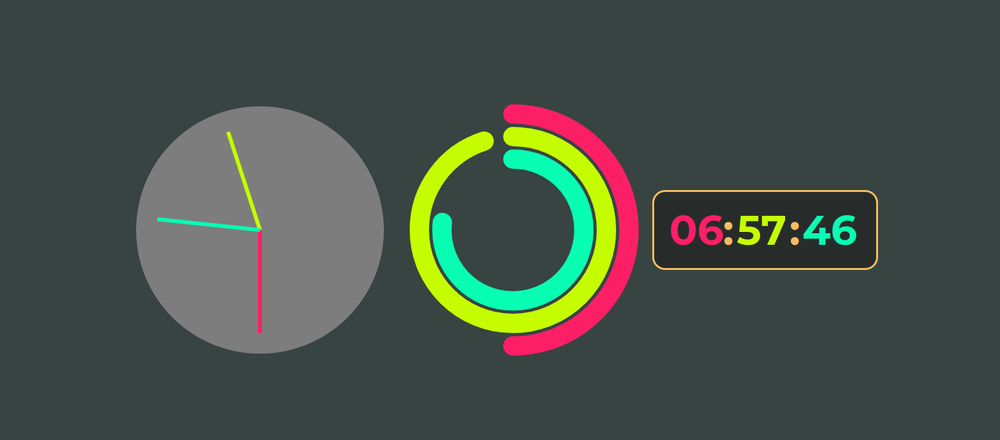

# Clock ⌚

> ## Check this code in [action](https://filotaxis.github.io/clocks/)

In this project I practiced CSS a lot, the first clock is based on the challenge 2 of the JAvascript30 challenge. For the second one, I took inspiration from the apple watch face, using SVG for that. Finally, for the third one, I only add the time to a container.

